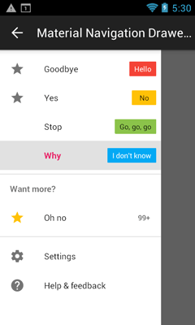
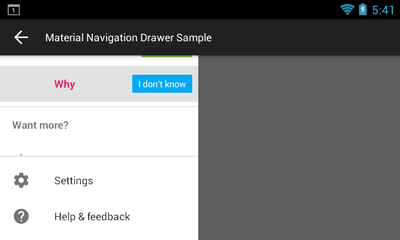
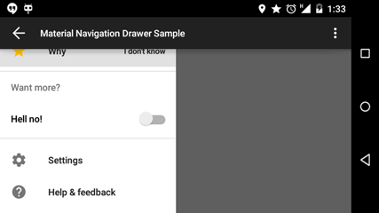
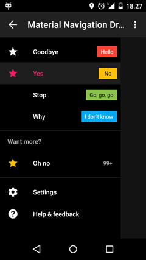
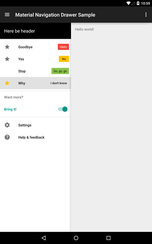
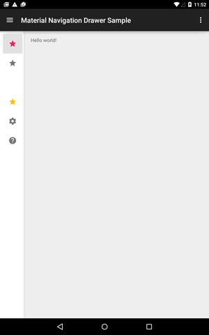
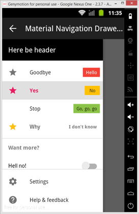
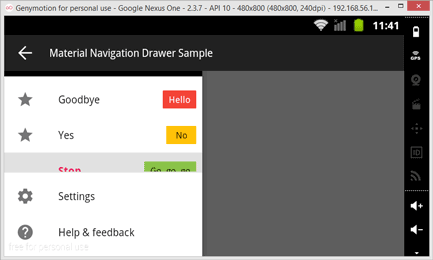

Material Navigation Drawer
==========================

Navigation Drawer according to Material Design spec.

Contains native and support fragments of expanded and collapsed navigation list for use with `DrawerLayout` or Chiu-Ki Chan's `CrossFadeSlidingPaneLayout` (included).

The library is now available from API 4.

How to get the library?
-----------------------

To use this library add the following to your module's `build.gradle`:
```groovy
dependencies {
    compile 'net.xpece.material:navigation-drawer:0.5.4'
}
```

The project currently depends on support-v4 library version 21.0.3.

Default behavior
----------------

 - Icon color defaults to `android:textColorSecondary` when not selected. See `SimpleNavigationItemDescriptor` or `BaseNavigationItemDescriptor`.
 - Text color and selected icon color defaults to 100% white or 87% black based on background. See `SimpleNavigationItemDescriptor` or `BaseNavigationItemDescriptor`.
 - Activated background is set to 12% of `android:colorForeground`. This currently limits the use to white drawer on white theme or black on black.
 - List background is set to `android:colorForegroundInverse` by default.
 - Divider color is 12% of `android:colorForeground`. You cannot change this currently.

Customization
-------------

**The drawer has too big right margin!**

As of support-v4 library 21.0.3 there is a hardcoded margin of 64dp in a `DrawerLayout`. Use `NavigationDrawerUtils.fixMinDrawerMargin(DrawerLayout)` to remove this limitation. Use this right after you obtain a drawer layout instance typically in `Activity.onCreate(Bundle)`. Why is this an issue? Specs say the margin should be only 56dp on phones.

**I want the drawer to have a standard width!**

To set proper drawer width according to specs call `NavigationDrawerUtils.setProperNavigationDrawerWidth(View)` on your instance of `NavigationDrawerFragment.getView()`. This is not handled automatically to allow developers to reuse the fragment outside of `DrawerLayout` with custom width.

The width will be one of the following:
- On phones: Smallest screen width minus 56dp, maximum 280dp. The width is same in both portrait and landscape.
- On tablets: ~~Effectively always 320dp.~~ 280dp. Because it looks better (on 7" tablet the drawer has less than half screen width) and everyone's using it.

**I want the drawer to have a different background!**

You can modify the navigation list background by accessing one of `NavigationDrawerFragment.setBackground()` methods. Please note that the same background will be used for the pinned section. So if you use the pinned section always use a fully opaque color for background.

**How do i build sections?**

`NavigationSectionDescriptor`

 - Use `heading(String)` to set optional section heading.
 - Use `addItem(NavigationItemDescriptor)` or `addItems(List<NavigationItemDescriptor>)`. These allow you to chain calls as opposed to standard `List` methods.
 
**How do I build items?**

`BaseNavigationItemDescriptor`

- Use `sticky()` and `notSticky()` to specify whether the item should stay selected on click or not.
- Use ~~`icon(int)`~~ `iconResource(int)` to specify a drawable resource. Typically this would be a 24dp by 24dp icon. This gets colored automatically. Width limit is 40dp.
- Use `iconColorAlwaysPassiveOn()` to override the icon color in any state by the passive color.
- Use `text(String)` or `text(int)` to set item label.
- Use `activeColor(int)` and its derivatives to specify color of selected icon and text.
- Use `passiveColor(int)` and its derivatives to specify color of unselected icon. Note that unselected text always takes color of `android:textColorPrimary`.

`SimpleNavigationItemDescriptor` extends `BaseNavigationItemDescriptor`

- Use `badge(String)` or `badge(int)` to set badge text. Badge will be hidden when supplied value is `null`;
- Use `badgeColor(int)` and its derivatives to specify background color of the badge. Text color is calculated automatically.
 
**How do I make custom items?**

Extend either `BaseNavigationItemDescriptor` or `AbsNavigationItemDescriptor`. Both require you to implement method `getLayoutId()` which returns your custom layout resource ID. You also need to implement you own `loadInto(View, boolean)` method which is analogous to adapter's `getView(...)`. If you need a view holder pattern call `askViewHolder(View, int)`.

`AbsNavigationItemDescriptor` does nothing for you. What you implement is what you get. See the `ToggleNavigationItemDescriptor` in sample project. Note that this is a quick and crude example.

`BaseNavigationItemDescriptor` allows you to use all the good stuff described above. Your custom layout is required to have a `@id/icon` image view and a `@id/text` text view. It's intended for cases where you need a custom view on the right side of the item.

**How do I employ partially visible collapsed navigation (like Gmail on tablets)?**

 Please see the example project, mainly `res/layout-sw600dp/activity_main.xml` and `MainActivity.java`.
 Only descriptors which implement `GraphicNavigationItemDescriptor` will be painted (both base and simple descriptors comply).

Changelog
---------

**0.5.4**
- *FIXED:* Some items failed to set activated background. Not anymore!

**0.5.3**
- *FIXED:* `.aar` packaging in POM file specified
- *FIXED:* Currently selected item does not draw selector
- *FIXED:* `setSelectedItem` not selecting proper item when using headers

**0.5.2**
- *NEW!* Support from API 4

**0.5.1**
- *NEW!* Introduced collapsed version of navigation list
- *NEW!* Included Chiu-Ki Chan's [`CrossFadeSlidingPaneLayout`](https://github.com/chiuki/sliding-pane-layout) for convenience
- *CRITICAL BUG FIX:* Header View now works correctly before KITKAT

**0.4.3**
- *NEW!* Introduced custom view types support
- *NEW!* Added native fragment support by `NavigationListFragment`
- Support-v4 fragment accessible under `SupportNavigationListFragment`
- Some changes in API (e.g. `NavigationItemDescriptor` is now `SimpleNavigationItemDescriptor`)
- Changed package name from `net.xpece.materialnavigationdrawer` to `net.xpece.material.navagationdrawer` (so sorry!)
- More changes in package names (even more sorry, this time it's final)
- Utilities made public in `net.xpece.material.navigationdrawer.internal` package
 - Text color calculation based on background
 - Attribute resolution to colors or drawables
 - Drawable tinting
- *CRITICAL BUG FIX:* Certain configurations with pinned section caused the list view go apes**t rendering it unusable.

**0.3.0**
- Item padding is clamped at 16dp even on tablets (everybody does this and it aligns with the back arrow)
- *NEW!* Different text style for badges without background (as in Gmail app)
- Badge minWidth is now 40dp instead of 24dp (as in Gmail app)
- Badge right margin is set to zero to allow the text to be 16dp from the right edge (as in Gmail app)
- Better compatibility with dark themes
 - Pinned section divider is shown when shadow would not be recognizable
 - Default icon color is 100% white on dark themes
 - Added screenshots to `/docs`
- Ability to override icon color through `BaseNavigationItemDescriptor.iconColorAlwaysPassiveOn()`
- Drawer width on phones is now always `smallestWidthDp` minus `56dp` (the `5 * 56dp` limit still applies).

**0.2.2**

- Fixed extra list view spacing when using header views
- Added `NavigationDrawerItem` to callback + some minor API changes
 
**0.2.1**

- Fixed NPE on inflating fragment
- Dropped appcompat-v7 dependency
- *NEW!* Introduced pinned navigation list section
- Updated sample project
- Minor API changes
- Navigation list no longer sets its width automatically to allow more control to developer
 
**0.1.1**

- First release
- Navigation list with multiple sections with optional headings
- Items have a label, optional icon and an optional text badge
- Icon has a passive color, label and icon have an active color
- Badge has background color, text color gets calculated automatically
- Items can remain selected

Work TBD
--------

 - Better API, factories, copying element prototypes
 - Custom passive text color

Screenshots
-----------

`JELLYBEAN` light theme

&nbsp;


`LOLLIPOP` light theme

&nbsp;
 

`LOLLIPOP` dark theme

&nbsp;
 

`LOLLIPOP` tablet

&nbsp;
 

`GINGERBREAD`

&nbsp;
 
